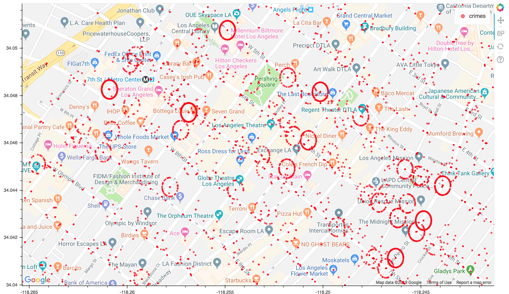
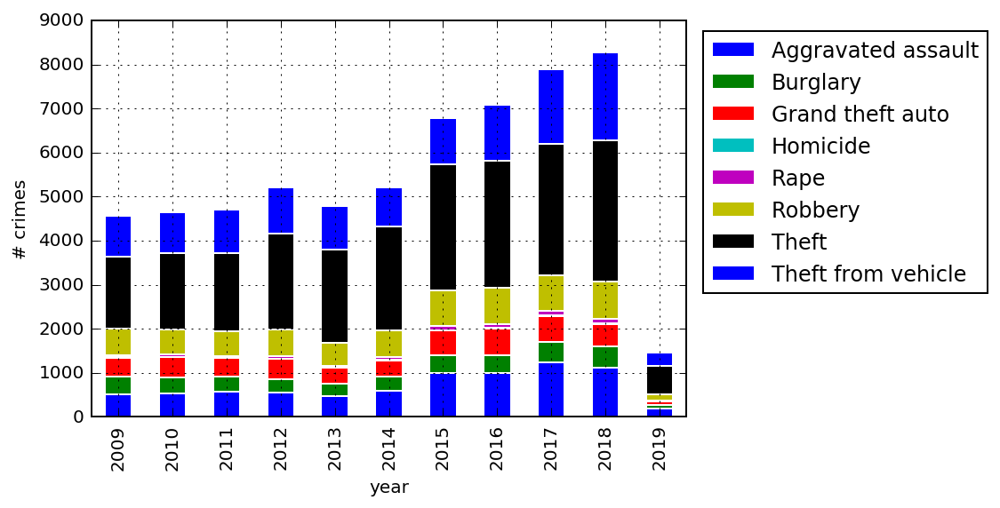
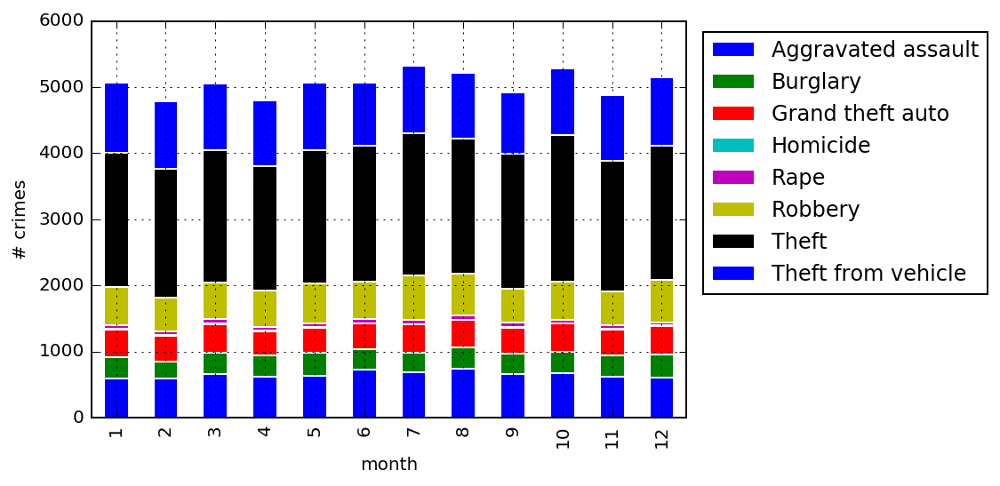
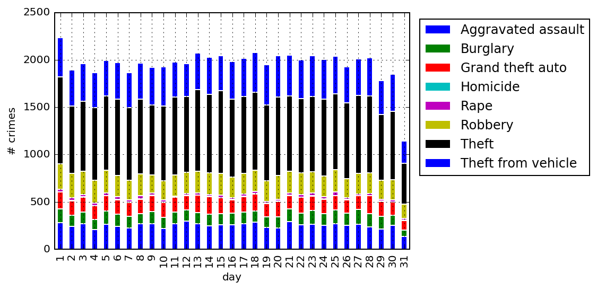
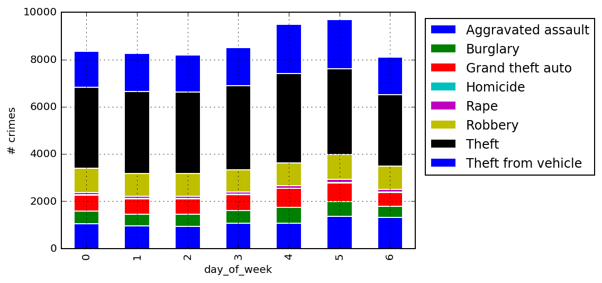
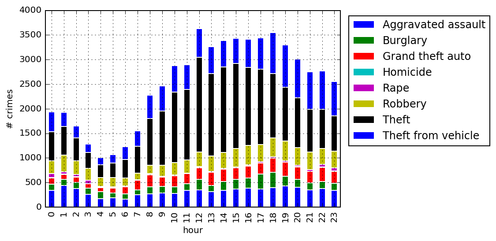

# Analysis of crime data in downtown Los Angeles

- data is collected from Los Angeles Times, http://maps.latimes.com/crime/
- data ranges from 2009 to early March of 2019

##### The distribution of crimes

As seen, the [Skid Row](https://en.wikipedia.org/wiki/Skid_Row,_Los_Angeles)
(lower right) area is much worse than the other areas.

# Stats

### Crime by year

So the crime number is actually increasing in recent years, but it could be due to better way of reporting crimes.

### Crime by month

Not much difference from month to month

### Crime by day of the month

Not much difference from day to day

### Crime by day of the week

0 is Monday
([ref](https://pandas.pydata.org/pandas-docs/stable/reference/api/pandas.Series.dt.dayofweek.html)),
so Friday and Saturday are slightly worse.

### Crime by hour

Crime number goes up quickly and remains high during the day
